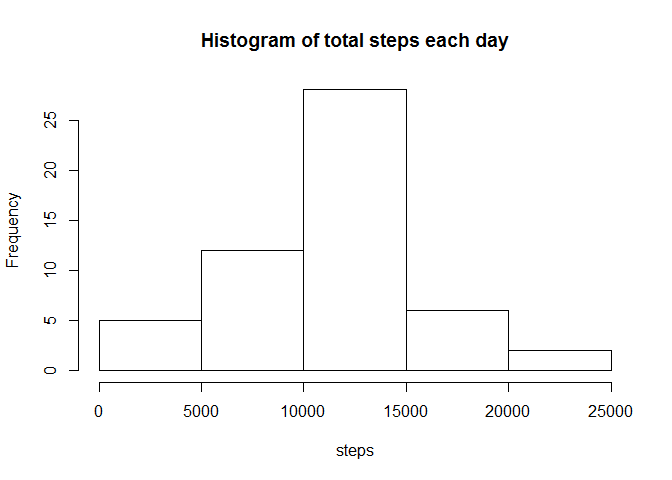
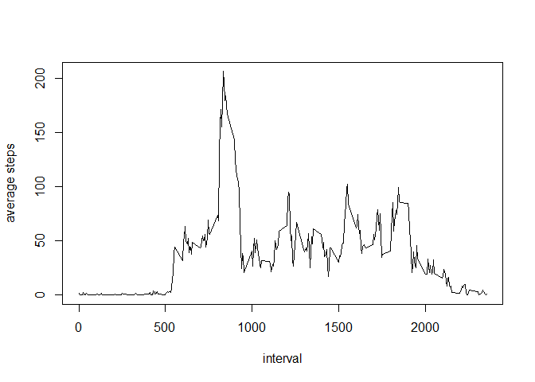
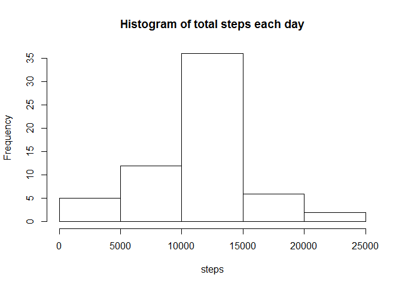
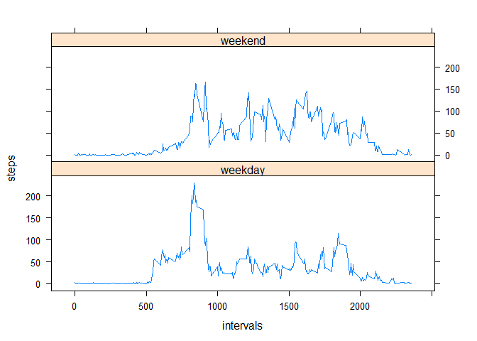

# Reproducible Research: Peer Assessment 1

## Loading and preprocessing the data

Show any code that is needed to

1. Load the data (i.e. read.csv())

2. Process/transform the data (if necessary) into a format suitable for your analysis


```r
data<-read.csv("activity.csv")
data<- transform(data,interval=as.factor(data[,3]))
```

##What is mean total number of steps taken per day?

For this part of the assignment, you can ignore the missing values in the dataset.


```r
subdata<-data[!is.na(data[,1]),]
result<-tapply(subdata[,1],subdata[,2],sum)
print (result)
```

```
## 2012-10-01 2012-10-02 2012-10-03 2012-10-04 2012-10-05 2012-10-06 
##         NA        126      11352      12116      13294      15420 
## 2012-10-07 2012-10-08 2012-10-09 2012-10-10 2012-10-11 2012-10-12 
##      11015         NA      12811       9900      10304      17382 
## 2012-10-13 2012-10-14 2012-10-15 2012-10-16 2012-10-17 2012-10-18 
##      12426      15098      10139      15084      13452      10056 
## 2012-10-19 2012-10-20 2012-10-21 2012-10-22 2012-10-23 2012-10-24 
##      11829      10395       8821      13460       8918       8355 
## 2012-10-25 2012-10-26 2012-10-27 2012-10-28 2012-10-29 2012-10-30 
##       2492       6778      10119      11458       5018       9819 
## 2012-10-31 2012-11-01 2012-11-02 2012-11-03 2012-11-04 2012-11-05 
##      15414         NA      10600      10571         NA      10439 
## 2012-11-06 2012-11-07 2012-11-08 2012-11-09 2012-11-10 2012-11-11 
##       8334      12883       3219         NA         NA      12608 
## 2012-11-12 2012-11-13 2012-11-14 2012-11-15 2012-11-16 2012-11-17 
##      10765       7336         NA         41       5441      14339 
## 2012-11-18 2012-11-19 2012-11-20 2012-11-21 2012-11-22 2012-11-23 
##      15110       8841       4472      12787      20427      21194 
## 2012-11-24 2012-11-25 2012-11-26 2012-11-27 2012-11-28 2012-11-29 
##      14478      11834      11162      13646      10183       7047 
## 2012-11-30 
##         NA
```

1. Make a histogram of the total number of steps taken each day


```r
hist(result,main="Histogram of total steps each day", xlab="steps")
```

 

2. Calculate and report the mean and median total number of steps taken per day

```r
mean(result,na.rm=TRUE)
```

```
## [1] 10766.19
```

```r
median(result,na.rm=TRUE)
```

```
## [1] 10765
```


## What is the average daily activity pattern?

1. Make a time series plot (i.e. type = "l") of the 5-minute interval (x-axis) and the average number of steps taken, averaged across all days (y-axis)


```r
timeslot<-tapply(subdata[,1],subdata[,3],mean)

d<-data.frame(steps=timeslot,interval=names(timeslot))
plot(as.numeric(as.character(d[,2])),d[,1],type="l",xlab="interval",ylab="average steps")
```

 

2. Which 5-minute interval, on average across all the days in the dataset, contains the maximum number of steps?


```r
timeslot[timeslot==max(timeslot)]
```

```
##      835 
## 206.1698
```

So, the interval 835 has maximum number of steps.


## Imputing missing values

Note that there are a number of days/intervals where there are missing values (coded as NA). The presence of missing days may introduce bias into some calculations or summaries of the data.

1. Calculate and report the total number of missing values in the dataset (i.e. the total number of rows with NAs)


```r
sum(!complete.cases(data))
```

```
## [1] 2304
```

2. Devise a strategy for filling in all of the missing values in the dataset. The strategy does not need to be sophisticated. For example, you could use the mean/median for that day, or the mean for that 5-minute interval, etc.

Strategy: replace the missing values with the mean for that 5-minute interval. 


```r
data[is.na(data$steps), "steps"] <- tapply(data[,1],data[,3],mean,na.rm=TRUE)[ data[is.na(data$steps),"interval"] ] 
```


3. Create a new dataset that is equal to the original dataset but with the missing data filled in.


```r
write.csv(data,file="newdata.csv")
```

Now, the new.data.csv is the equal to the original dataset but with missing data filled in. 


4. Make a histogram of the total number of steps taken each day and Calculate and report the mean and median total number of steps taken per day. Do these values differ from the estimates from the first part of the assignment? What is the impact of imputing missing data on the estimates of the total daily number of steps?


```r
result<-tapply(data[,1],data[,2],sum)
hist(result,main="Histogram of total steps each day", xlab="steps")
```

 

```r
mean(result)
```

```
## [1] 10766.19
```

```r
median(result)
```

```
## [1] 10766.19
```

We can see that, overall shape of histogram remains the same except that more steps in the interval 10000-15000 are added. The mean is the same as the original data without replacing NAs, but median is different from the previous one. In other word, imputing missing values with mean values does not affect the mean in new data, but will affect median values.


## Are there differences in activity patterns between weekdays and weekends?

For this part the weekdays() function may be of some help here. Use the dataset with the filled-in missing values for this part.

1. Create a new factor variable in the dataset with two levels – “weekday” and “weekend” indicating whether a given date is a weekday or weekend day.


```r
day<-lapply(data[,2],function(x){y<-weekdays(as.Date(x))
              return(ifelse(y=="Saturday" | y=="Sunday","weekend","weekday"))})
  		  
data$day<-as.factor(as.character(day))
```


2. Make a panel plot containing a time series plot (i.e. type = "l") of the 5-minute interval (x-axis) and the average number of steps taken, averaged across all weekday days or weekend days (y-axis). See the README file in the GitHub repository to see an example of what this plot should look like using simulated data.


```r
library(lattice)
y<-split(data,data$day)
z<- lapply(y,function(x) tapply(x$steps,x$interval,mean))
result<- data.frame(steps = numeric(), interval=character(),day = character())
for (i in 1:length(z)){
    date<-rep(names(z[i]),length(z[[i]]))
    d<-data.frame(steps=z[[i]],interval=names(z[[i]]),day=date)
  	result<-rbind(result,d)
}
#print (result)
xyplot(steps ~ as.numeric(as.character(interval)) | day, result, type = "l", layout = c(1, 2),xlab="intervals",ylab="steps")
```

 

From the plotted result, we can see that the general trends of weekend and weekday are similar. That is, lower steps in interval <500 or >2000, and higher steps at 750<interval<1000. Steps for the weekend intervals are in general lower than that of weekday. 
